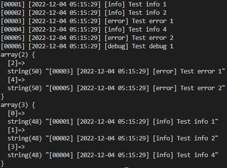

# MyLogger

My logger - мой логгер ))

## Примеры использования логгера

### Пример 1

```php
use vadimcontenthunter\MyLogger\MyLogger;
use vadimcontenthunter\MyLogger\modules\ConsoleLogger;
use vadimcontenthunter\MyLogger\formatters\BaseFormatter;
use Psr\Log\LogLevel;

$consoleLogger = new ConsoleLogger(BaseFormatter::class);
$myLogger = new MyLogger($consoleLogger);
$myLogger->info('Test info 1');
$myLogger->info('Test info 2');
$myLogger->error('Test error 1');
$myLogger->info('Test info 4');
$myLogger->error('Test error 2');
$myLogger->debug('Test debug 1');

$myLogger->execute(function($logger){
    if($logger instanceof ConsoleLogger){
        var_dump($logger->getLogMessageFromListLogsByStatusLog(LogLevel::ERROR));
    }
});

var_dump($consoleLogger->getLogMessageFromListLogsByStatusLog(LogLevel::INFO));
```

**Результат выполнения:**


